# Тест-кейсы для приложения "СберБанк Онлайн"

**Устройство**: Realme RMX3085 (8/128GB, Android 13)  
**Версия приложения**: 16.9.0  
**Дата тестирования**: 19.06.2025

## Содержание
1. [Перевод денег между счетами](#1-перевод-денег-между-счетами-позитивный-сценарий)
2. [Попытка перевода нулевой суммы](#2-попытка-перевода-нулевой-суммы-негативный-сценарий)
3. [Проверка истории транзакций](#3-проверка-отображения-истории-транзакций)

## 1. Перевод денег между счетами (позитивный сценарий)
**ID:** TC-PAY-001  
**Приоритет:** High  
**Тип:** Функциональное тестирование

### Предусловия:
1. Пользователь авторизован в приложении
2. На балансе отправителя ≥ 10 ₽
3. Получатель добавлен в контакты

### Шаги:
1. Открыть раздел "Переводы"
2. Выбрать получателя
3. Ввести сумму "10 ₽"
4. Нажать "Подтвердить"
5. Ввести SMS-код подтверждения

### Ожидаемый результат:
- Появляется уведомление "Перевод выполнен"
- В истории операций отображается новая транзакция:
  - Сумма: 10 ₽
  - Статус: "Завершено"
- Баланс отправителя уменьшается на 10 ₽

```json
// Пример ожидаемого ответа API
{
  "status": "success",
  "transaction_id": "TRX-12345",
  "new_balance": 5000
}
```
### Фактический результат: 


**Скриншоты**:  

<table style="width: 100%; border-collapse: collapse; margin: 20px 0;">
  <tr style="text-align: center;">
    <td style="padding: 10px; border: 1px solid #f0f0f0; vertical-align: top;">
      <a href="screenshots/fullsize/find_contact.png">
        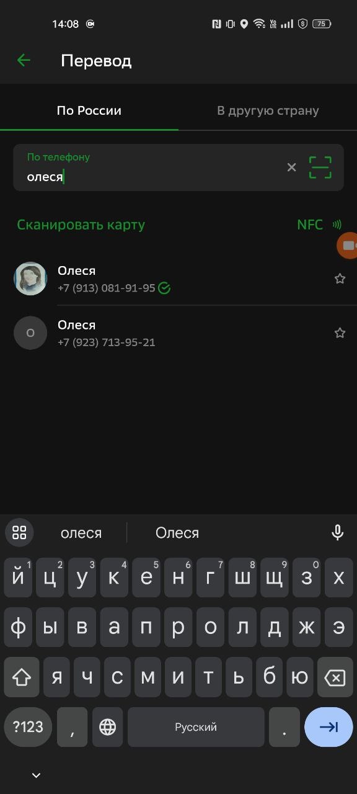
      </a>
      <p style="margin-top: 8px; font-size: 13px; color: #555;">1. Поиск контакта</p>
    </td>
    <td style="padding: 10px; border: 1px solid #f0f0f0; vertical-align: top;">
      <a href="screenshots/fullsize/enter_amount.png">
        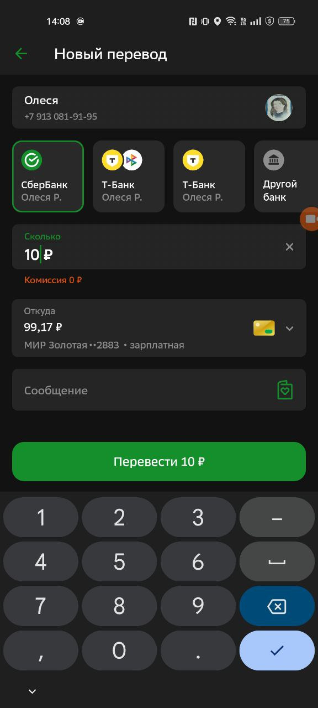
      </a>
      <p style="margin-top: 8px; font-size: 13px; color: #555;">2. Ввод суммы</p>
    </td>
    <td style="padding: 10px; border: 1px solid #f0f0f0; vertical-align: top;">
      <a href="screenshots/fullsize/money_transfer.png">
        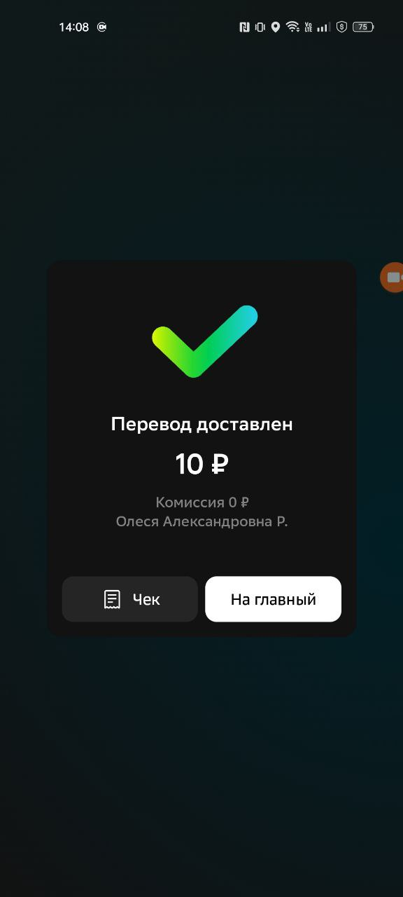
      </a>
      <p style="margin-top: 8px; font-size: 13px; color: #555;">3. Подтверждение</p>
    </td>
    <td style="padding: 10px; border: 1px solid #f0f0f0; vertical-align: top;">
      <a href="screenshots/fullsize/history_of_money_transfers.png">
        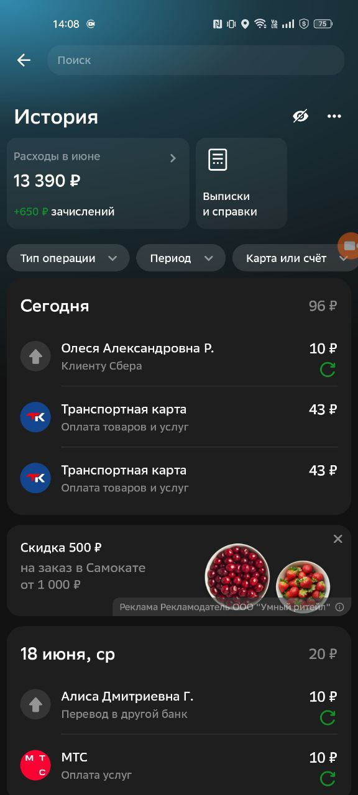
      </a>
      <p style="margin-top: 8px; font-size: 13px; color: #555;">4. История операций</p>
    </td>
  </tr>
</table>


### Статус: Успешно 


## 2. Попытка перевода нулевой суммы (негативный сценарий)
**ID:** TC-PAY-002  
**Приоритет:** Medium  
**Тип:** Негативное тестирование

### Шаги:
1. В поле "Сумма" ввести "0 ₽"
2. Нажать "Подтвердить"

### Ожидаемый результат:
- Появляется сообщение "Укажите сумму перевода"
- Кнопка "Подтвердить" остается неактивной

### Фактический результат: 

**Скриншоты**:  


[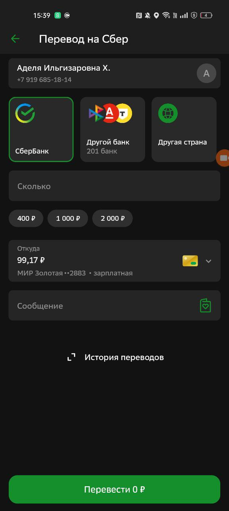](screenshots/fullsize/send_zero.png)

[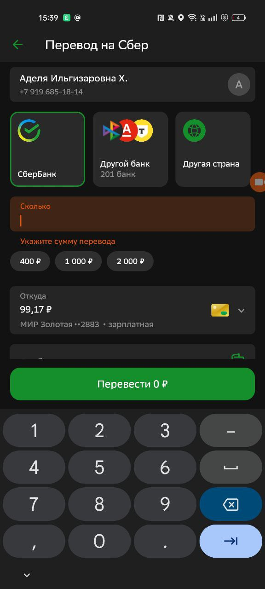](screenshots/fullsize/fail_send_zero.png)


### Статус: Успешно 


## 3. Проверка отображения истории транзакций

**ID**: TC-PAY-003 
**Приоритет**: High  
**Тип теста**: Функциональный  
**Предусловие**: 
- Пользователь авторизован
- Совершено ≥3 транзакции за последние 7 дней

## Шаги тестирования
1. Открыть раздел "История операций"
2. Прокрутить список до конца
3. Выполнить pull-to-refresh
4. Нажать на любую транзакцию

## Ожидаемый результат
| Элемент               | Требование                      |
|-----------------------|---------------------------------|
| Сортировка            | Новые операции сверху           |
| Поля транзакции       | Дата, сумма, контрагент, статус |
| Пагинация             | Подгрузка по 20 записей         |
| Pull-to-refresh       | Обновляет список                |
| Темная тема           | Корректное отображение          |

### Фактический результат: 

**Скриншот**:  
[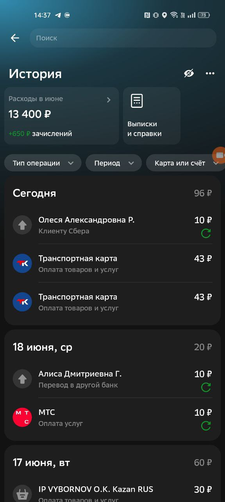](screenshots/fullsize/history.png)

### Статус: Успешно 

## 4. Быстрые проверки (Smoke-тесты)
| ID       | Проверка                          | Шаги                      | Ожидаемый результат          |
|----------|-----------------------------------|---------------------------|------------------------------|
| TC-SM-01 | Открытие главного экрана         | Запустить приложение      | Виден баланс                 |
| TC-SM-02 | Работа поиска по операциям       | Ввести "АЗС" в поиск      | Показываются АЗС-платежи     |
| TC-SM-03 | Смена темы (темная/светлая)      | Настройки → Внешний вид   | Интерфейс меняется           |


## 4. Смена темы (темная/светлая)
**ID:** TC-UI-004  
**Приоритет:** Low  
**Тип:** UI-тестирование  

### Предусловия:
1. Приложение установлено и запущено
2. Пользователь авторизован

### Шаги:
1. Открыть боковое меню (свайп вправо)
2. Нажать "Настройки"
3. Выбрать "Внешний вид"
4. Переключить тумблер "Темная тема"
5. Вернуться на главный экран

### Ожидаемый результат:
| Элемент | Требование |
|---------|------------|
| Фон | Изменяется согласно выбранной теме |
| Текст | Сохраняет читаемость  |
| Иконки | Корректно инвертируются |
| Состояние | Сохраняется после перезапуска приложения |


### Фактический результат: 
**Скриншоты:**  
[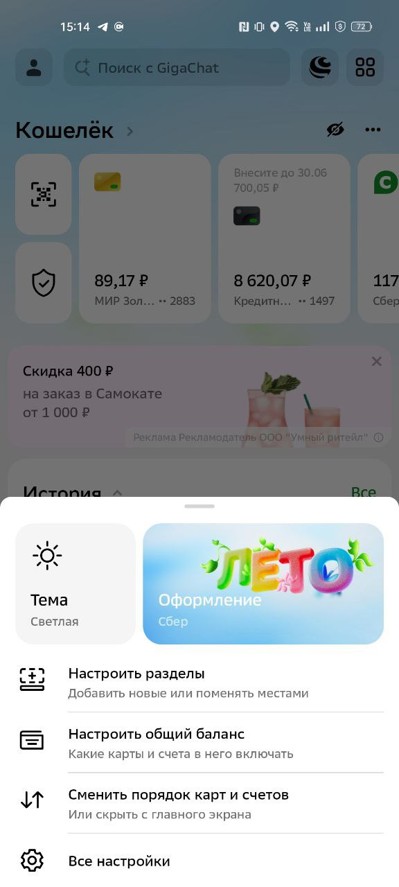](screenshots/fullsize/light_theme.png)

[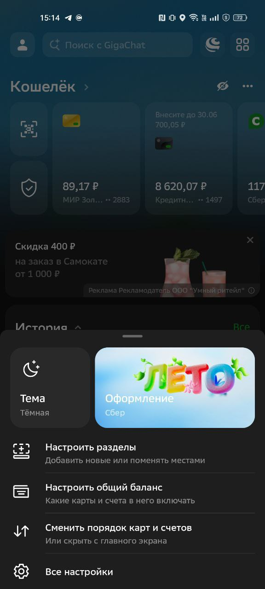](screenshots/fullsize/dark_theme.png)

<!-- [](screenshots/fullsize/light_theme.png) 

[](screenshots/fullsize/dark_theme.png) -->


### Статус: Успешно 
---

## 5. Оплата мобильной связи МТС
**ID:** TC-PAY-005  
**Приоритет:** High  
**Тип:** Функциональное тестирование

### Предусловия:
1. Баланс ≥ 10 ₽
2. Номер МТС в формате 9XX-XXX-XX-XX

### Шаги:
1. Открыть раздел "Платежи"
2. Выбрать "Платежи" → "Мобильная связь" → "МТС"
3. Ввести номер телефона
4. Ввести сумму "10 ₽"
5. Нажать "Оплатить"
6. Подтвердить SMS-кодом

### Ожидаемый результат:
1. Появляется чек с данными:
   - Номер: [введенный]
   - Сумма: 10 ₽
   - Комиссия: 0 ₽
2. Баланс уменьшается на 10 ₽


### Фактический результат:
**Скриншоты:**

**Перешли в платежи мтс, ввели номер телефона:**  
[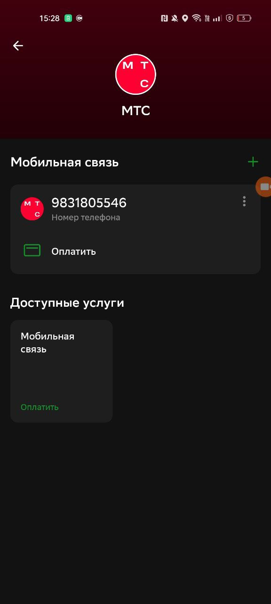](screenshots/fullsize/to_mts.png)


**Ввели сумму перевода (10 рублей):**  
[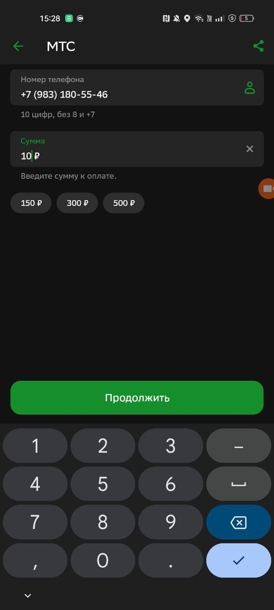](screenshots/fullsize/mts_enter_10.png)


**Перешли в платежи мтс, ввели номер телефона:**  
[](screenshots/fullsize/to_mts.png)


**Перешли в платежи мтс, ввели номер телефона:**  
[](screenshots/fullsize/to_mts.png)
